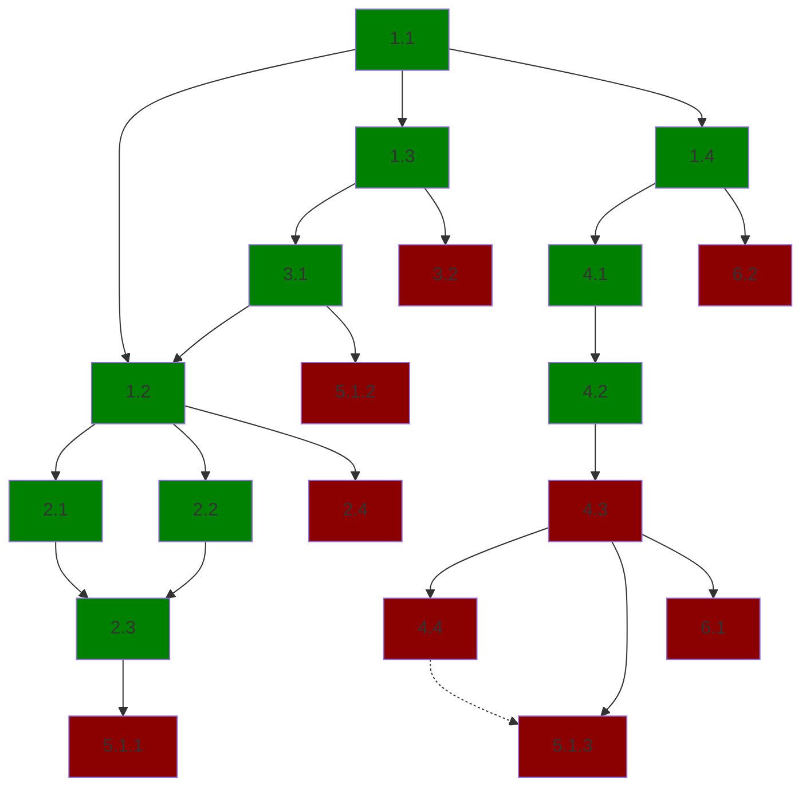

# TODO
> In progess.

## MVP

The first milestone for OATMILK (OM) is to become a minimum viable "product". To accomplish this we need
a clear definition of what OM wants to be in the future and what it can become at this stage.

OATMILK is an acronym for _Organize All The Media I Love? K._. Contrary to what the name may imply, hosting 
any sort of media is a non-goal. Furthermore, development is primarily around music, but the name is left
open to allow for future growth without, albiet insignificant, rebranding.

To develop the motivation for this project, let's use my current predicaments as a case study.

I listen to a fair bit of music. Let's take the statistics from my primary streaming service last year:

- 182,482 minutes
- 6,646 artists
- 22,370 songs
- 1,772 albums

Now, this scale presents several difficulties. I love curation; creating playlists around specific themes,
genres, etc. And often times I can remember a melody/riff/lyric that I feel would be perfect, but can't
place what artist it's from, much less what song. Alongside this, when creating playlists for others, I
do my due diligence and listen to each track before adding it. Despite this, I don't make many playlists,
and while I find the joys of re-discovering music quite amazing, I know that there will be some tracks
I'll never stumble upon again.

I hope for OM to alleviate the problems I am facing. I want a system where I can review songs, collect
background information on songs/albums/artists, verbosely tag tracks, and much more. With the ability to
store and use so much private, _human-made_ data, I hope to further my enjoyment of music and appreciation
of those who make it.

Motivation aside, what does OATMILK need to do? At its simplest, it's a database wrapper; to which I've
chosen SQLite. The schema of the database is modeled in DBML (for visualization-sake), compiled into
SQLite (via `dbml_sqlite`), and mirrored into Rust structs (for usage with `sqlx`). That API, `om-core` 
is then consumed by `om-web` which is an `axum` application using `askama` for templating.

Fundementally, the most important choice at the initial stages is data modeling. The schema needs to be
defined with enough flexibility to allow for future additions, without being so unconstrained that it
is allowed to evolve into a disorganized mess. 

Currently we model several primitives: Tracks, Collections, Artists, People, and Tags; most of which are
elaborated with junction tables (i.e. Tags per Track). While we could dynamically associate user-defined
fields with each primitive, so as to not "over-constrain" use-cases, I feel that would be very messy. As
such each primitive has all their informational fields defined in their schemas. Each of the primitives
require the bare minimum for user differentiation (i.e. Tracks, beside their IDs, require a Title and 
Artist), which will allow for easy migration when more fields are added later.

With these primitives, we can represent the vast majority of information I would like to collect into the
system, but field specifications not representable in SQLite's type system need to be further elaborated.
For instance, I would like `description`s to have the capabilities of rich-text which has little consequence 
on the backend. 

With all that preamble out of the way, we can finally define some tasks and structure:

1. [x] Setup the initial project structure
    1. [x] Create the `cargo` workspace for three crates: `om-core`, `om-core-proc`, and `om-web`.
    2. [x] `om-core` is reponsible for interfacing with SQlite (via `sqlx`) and briding a public API
            for `om-web` to interact with. 
    3. [x] `om-core-proc` works with `om-core` and adds a derive macro for SQL'd structs to be easily
            inserted, modified, etc. in the DB.
    4. [x] `om-web` runs an Axum web server that templates results from `om-core` with `askama`.
2. [ ] Initial `om-core`
    1. [x] Basic lifecycle (init, deinit, etc.) for the database bridge.
    2. [x] Structs modeled per `sqlx::FromRow` rules and kept in sync with `om-core/model.dbml`.
    3. [x] Add basic generic over trait insertion and selection methods to the database.
    4. [ ] Keep a log of all modifications to the database so they can be rolled back, either infinitely or for some time frame.
3. [ ] Initial `om-core-proc`
    1. [x] A derive macro to implement a trait and it's associated methods on all synced structs in `om-core`.
    2. [ ] A proc macro to generate structs from DBML descriptions (as done manually in 2.2.).
4. [ ] Initial `om-web`
    1. [x] Setup the axum server and index route with state.
    2. [x] Query `om-core` for a list of tracks to display on the index.
    3. [ ] Add functionality to search for, insert, and remove tracks.
    4. [ ] Add a cache for more efficient pagination.
        - Might want to move this to `om-core` maybe?
5. [ ] Performance
    1. [ ] Establish initial benchmarks for each crate.
        1. [ ] `om-core`: `init/deinit`, `insert`, `query`, etc.
        2. [ ] `om-core-proc`: less so.
        3. [ ] `om-web`: `rendering`, `query`, etc.
6. [ ] Visuals
    1. [ ] Beautify `om-web`.
    2. [ ] Add more asset preprocessing to `om-web/build.rs`.

## Dependencies

